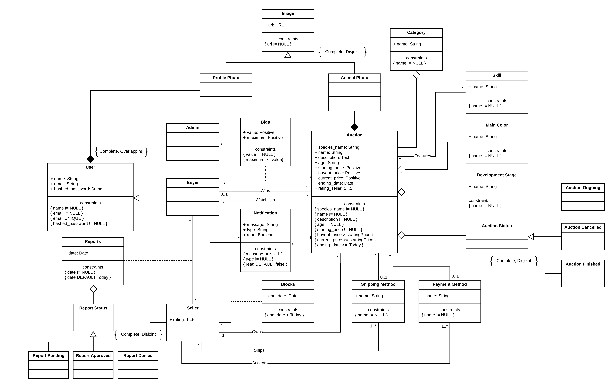

# A4: Conceptual Data Model

The product consists of an online auction website where you are able to bid on and create auctions.
    
In this artifact we have the objective of defining the structure of the database, more specifically its classes and the relationships between them, as well as providing a static view of its contents. We shall also define business rules in order to express more general restrictions of how the database should work.

## 1. Class diagram

Fig 1 - Conceptual Data Model Diagram 

## 2. Additional Business Rules
 
* Only the Buyer who won the auction can rate the Seller.
* Only the Buyer who won can decide which of the pre-defined available shipping and payment methods will be used.
* Whenever the ending date of an auction is reached or the buyout price is met, the auction status will be set to finished.
* Whenever the Seller or Admin stops an auction, the auction status is set to canceled.
* Whenever a Seller is Reported, the Report status will be set to pending, once the admin approves it or denies it, it will change to either of those.
* Once a Seller is successfully reported 3 or more times, his account will be blocked.
* Whenever an user wins an auction, his bid is surpassed or the ending date of an watchlisted auction is nearing, he receives a notification.

## Revision history

1. The conceptual data model diagram was changed. Some of the associations changed to aggregation or composition, the Report Status and Auction Status classes were also adapted in order to specify the types of status supported and the notification class (and its associations) was changed so that it can be possible to tell a certain user if a notification is new or not.

GROUP2053, 12/04/2020

* Carlos Miguel Sousa Vieira, up201606868@fe.up.pt
* João Alberto Preto Rodrigues Praça, up201704748@fe.up.pt (Editor)
* Lucas Tomás Martins Ribeiro, up201705227@fe.up.pt
* Silvia Jorge Moreira da Rocha, up201704684@fe.up.pt 